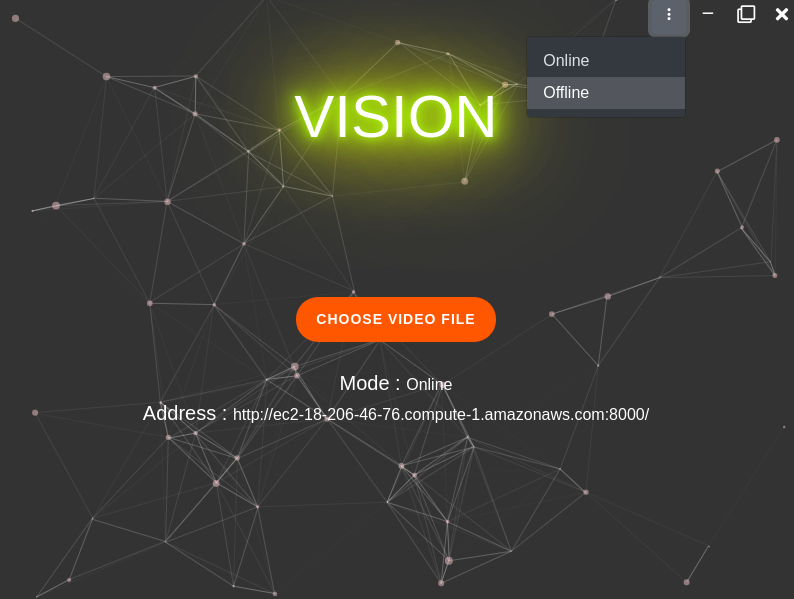

## 🔭 &nbsp; About this Project
In this project, we aim to develop a **real-time crime detection technology** that can be integrated with any security system, to ensure public safety through **visual crowd surveillance**. 
We have devised a complete software solution for safety and surveillance where we convert these CCTVs from an evidence collection to a crime prevention and detection tool to ensure safety and security.  This real-time crime detection technology is integrated with security systems and Desktop Application to get push-in notifications in case any suspicious activity is discovered.
The system will detect and simultaneously alert any violent activity captured by the camera.  The technologies encompasses domains of Computer Vision and Deep Learning models like **CNN, R-CNN, LSTM**. The dataset consists of 500+ videos scraped off internet and categorized into ***violent and non-violent*** activities. 
 

## 🛠 &nbsp;Tech Stack
&nbsp;
&nbsp;
&nbsp;
&nbsp; 
&nbsp;
&nbsp;
&nbsp;
&nbsp;

 

  

    
    

      
